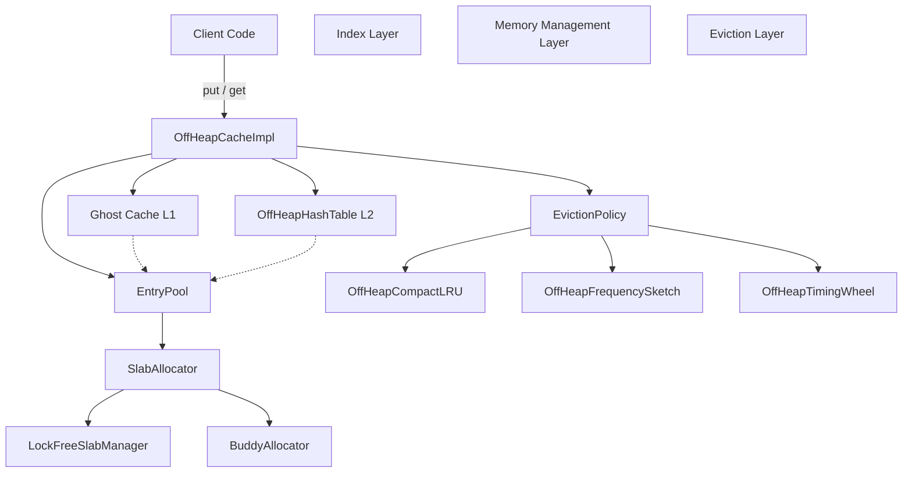
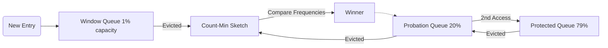

# RMCache Architecture & Technical Design

RMCache is a high-performance, billion-scale, near-zero-on-heap caching library for Java 22+. It leverages Project Panama's Foreign Function & Memory (FFM) API to manage massive datasets off-heap without garbage collection overhead, achieving sub-microsecond latencies.

## 1. High-Level Architecture

The system is designed around three pillars:
1. **Zero-Heap Data Storage**: Keys, values, and all metadata structures (hash tables, linked lists) reside in native memory.
2. **Lock-Free or Optimistic Concurrency**: Striped locks, `StampedLock` optimistic reads, and CAS operations minimize lock contention.
3. **Scan-Resistant Eviction**: A segmented LRU (SLRU) protected by a Count-Min Sketch (TinyLFU) prevents cache pollution from linear scans.

---

## 2. Memory Management Layer

Unlike Java objects, RMCache stores raw bytes in off-heap arenas.

### Slab Allocator
To avoid the high fragmentation and latency of calling `malloc()` per entry, RMCache uses slab classes (e.g., 64B, 128B, ... up to 1MB).
- **`LockFreeSlabManager`**: Each slab class is divided into chunks (slabs). Inside a slab, allocation is O(1) using an atomic `AtomicLongArray` bitmap and Compare-And-Swap (CAS).
- **Allocation Handle**: Pointers are compressed into a packed 64-bit `long` to avoid on-heap object allocation:
  - 40 bits: Offset (up to 1TB addressing)
  - 20 bits: Capacity in 64B granularity (up to 64MB)
  - 4 bits: Size Class (0-15)

### Buddy Allocator
Values exceeding the maximum slab size (e.g., >1MB) are delegated to the `BuddyAllocator`, which manages contiguous chunks of memory by recursively splitting blocks in half until the desired size is reached, allowing for efficient coalescing upon free.

---

## 3. Indexing Layer

### OffHeapHashTable
The primary directory mapping keys to `slot` IDs in the `EntryPool`.
- **Robin Hood Hashing**: Uses open addressing with Robin Hood probing to minimize probe lengths and lower variance in lookup times.
- **Lock Striping + StampedLock**: The hash table is partitioned into hundreds/thousands of stripes. Reads use `StampedLock.tryOptimisticRead()`, meaning most read operations proceed entirely without acquiring physical locks.
- **Graceful Resizing**: When a stripe exceeds its load factor, it doubles in size. The old memory segment is placed into a `retiredSegments` queue and reclaimed only after a grace period, preventing Use-After-Free crashes for concurrent optimistic readers.

### EntryPool
The source of truth for all entries. It stores parallel arrays of metadata (key/value offsets, expirations, hashes). 
Entries are referenced by a 32-bit `int slot`, capping total entries at ~2.1 billion per cache instance, while massively reducing memory overhead compared to 64-bit pointers.

---

## 4. Eviction & TTL Layer

### Memory Eviction (W-TinyLFU)
RMCache implements a Window TinyLFU policy completely off-heap.

- **`OffHeapCompactLRU`**: An SLRU mapping the three queues (Window, Probation, Protected). Linked-list pointers (next/prev) are stored in dense native arrays. To save memory, the queue identity (Window/Probation/Protected) is packed into the top 2 bits of the 32-bit `next` pointer.
- **`OffHeapFrequencySketch`**: A 4-bit Count-Min Sketch using a shared native memory segment to estimate access frequencies. It is scan-resistant and decays aggressively on periodic resets.

### Time-to-Live (TTL) Eviction
- **`OffHeapTimingWheel`**: Handles expiration using a hierarchical timing wheel overlaid on native memory. Avoids spawning O(N) timer threads or scanning O(N) entries. Only expired "ticks" are examined.

---

## 5. Fast-Path Optimizations

### Ghost Cache L1
A direct-mapped, lock-free 64-bit native array cache acting as an L1 shortcut for the Hash Table.
- It stores `(hash(key) << 32) | slot` in a single 64-bit word.
- Lookups use plain (non-volatile) 64-bit reads. This guarantees sub-microsecond lock-free pathing. Due to JVM alignment, tore reads either result in a clean hit or an instant `hashCode` mismatch fallback.

### Zero-Copy Access
By calling `cache.getView(key)`, the cache returns a `CacheValueView` containing a raw `MemorySegment` pointing directly into the slab's native memory. This completely bypasses intermediate `byte[]` on-heap allocation.

---

## 6. Concurrency & Safety

- **No `Unsafe`**: Built exclusively on Panama `java.lang.foreign` APIs for forward compatibility (JDK 21+).
- **Bounds Checking**: Native memory accesses are guarded by segment bounds.
- **Dangling Pointer Defense**: If a slot is evicted and repurposed concurrently, offset validations in the `EntryPool` prevent the system from reading stale data (the C3 fix).
