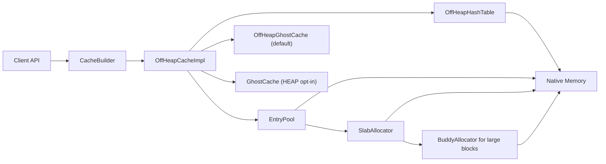

# RMCache

[](https://github.com/codeabbot/rmcache/actions/workflows/ci.yml)
[](LICENSE)

High-Performance, Billion-Scale Off-Heap Cache for Java 25+ (LTS)

RMCache is a specialized caching library for ultra-low latency and billion-scale capacity. It keeps **both keys and values off-heap** through the Java Foreign Function & Memory (FFM) API — with **no `sun.misc.Unsafe`** — so it sidesteps GC pauses at massive scale and stays future-proof as `Unsafe`'s memory-access methods are deprecated for removal from the JVM. That's the structural edge: on-heap caches are GC-bound at scale, and most other off-heap caches either keep keys on-heap (heap-bound at scale) or are built on that deprecated `Unsafe`.

In head-to-head JMH benchmarks, RMCache is the **fastest off-heap cache measured** — ahead of Chronicle Map, OHC, MapDB, and EhCache at every scale — its **write latency keeps pace with on-heap Caffeine**, and its **eviction hit rate matches Caffeine's W-TinyLFU** — all while keeping the Java heap nearly empty. [See the numbers ↓](#performance-benchmarks)

> **Requires JDK 25 or later** (LTS release). The FFM API is stable and fully supported from JDK 25. Run with `--enable-native-access=ALL-UNNAMED`.

---

## Key Features

- Zero-heap data path: keys, values, and index structures live off-heap.
- Java 25+ (LTS) FFM API: no Unsafe dependency.
- 64-bit slot packing: one 64-bit read for hash + slot.
- Key-match fast path + fingerprint check to reduce unnecessary comparisons.
- Zero-copy reads and large-value streaming support.
- GhostCache L1: AUTO defaults to OFF_HEAP; HEAP and DISABLED are explicit opt-ins.
- Memory estimator and index memory budgeting for predictable capacity planning.
- Background eviction to keep hot path latency low.
- Pull-based metrics with **zero hot-path cost**: Micrometer and OpenTelemetry bindings.
- **JSR-107 (JCache)** provider (Phase 1): drop-in for Spring Cache and Hibernate second-level cache — core operations; see the [Phase-1 limitations](docs/jcache.md).

---

## Architecture



---

## Performance Benchmarks

RMCache is an **off-heap** cache, so the fair comparison is against other off-heap caches — and it
is the fastest of them at every scale. On-heap **Caffeine is included only as a reference ceiling**:
on-heap and off-heap are different categories, because an on-heap cache never pays the cost of
crossing the heap boundary. The result worth highlighting is that **RMCache's PUT keeps pace with
on-heap Caffeine** even though every byte it stores lives off-heap.

Measured with JMH on macOS / JDK 25, 4 threads, 256-byte values, no eviction — every cache is
populated and measured in the **same run**, so the relative ordering holds even as absolute
latencies shift with hardware and load.

### GET latency (ns/op) — lower is better

| Cache | 10K | 100K | 1M |
| :--- | ---: | ---: | ---: |
| **RMCache** | 107 | 257 | 424 |
| **RMCache + GhostCache** | 126 | 236 | 413 |
| Chronicle Map | 251 | 305 | 445 |
| OHC | 284 | 430 | 629 |
| MapDB | 1,098 | 1,731 | 2,214 |
| EhCache | 1,639 | 1,765 | 2,003 |
| _Caffeine — on-heap reference_ | _65_ | _105_ | _254_ |

### PUT latency (ns/op) — lower is better

| Cache | 10K | 100K | 1M |
| :--- | ---: | ---: | ---: |
| **RMCache + GhostCache** | 130 | 278 | 474 |
| **RMCache** | 169 | 320 | 488 |
| Chronicle Map | 603 | 622 | 715 |
| OHC | 426 | 595 | 1,044 |
| EhCache | 2,460 | 2,740 | 3,095 |
| MapDB | 2,621 | 4,205 | 4,660 |
| _Caffeine — on-heap reference_ | _152_ | _248_ | _511_ |

**What the numbers say**

- **Fastest off-heap cache at every scale.** RMCache leads Chronicle Map by up to 2.3× on GET and 1.5–3.6× on PUT, beats OHC by roughly 2× on both, and is **5–15× faster than MapDB and EhCache**.
- **PUT rivals on-heap Caffeine.** At 10K–100K, RMCache + GhostCache (130 / 278 ns) is actually *faster* than Caffeine (152 / 248 ns); at 1M they sit within ~5%. Off-heap writes normally carry a heavy penalty — RMCache nearly erases it.
- **GET is bounded by physics, not design.** On-heap Caffeine returns an object reference directly; any off-heap cache must read native memory and materialize the value. RMCache pays that unavoidable cost and still lands within ~1.6× of Caffeine — the smallest gap of any off-heap cache here.
- **What you get in return:** zero GC pressure and headroom for **billions of entries**, because no key, value, or index structure ever touches the Java heap.

> Methodology: JMH `AverageTime`, 1 fork, 1 warmup + 2 measurement iterations — representative single-machine numbers, not error-bar-grade. Peers: Caffeine 3.1.8, Chronicle Map 2026.1, OHC 0.7.4, MapDB 3.0.9, EhCache 3.10.8.

Reproduce on your own hardware:

```
./gradlew jmh -Pjmh.includes="FairComparisonScaleBenchmark|OHCComparisonBenchmark"
```

### Tail latency (ns/op at 1M entries) — lower is better

Averages hide what latency-sensitive services actually feel: the tail. This is where off-heap
earns its keep — no GC means no GC-induced jitter. Measured with JMH `SampleTime`, 4 threads,
256-byte values.

**GET**

| Cache | p50 | p90 | p99 | p99.9 |
| :--- | ---: | ---: | ---: | ---: |
| **RMCache** | 417 | 542 | **667** | 3,248 |
| **RMCache + GhostCache** | 416 | 583 | 750 | **3,164** |
| Chronicle Map | 500 | 625 | 750 | 3,208 |
| _Caffeine — on-heap reference_ | _291_ | _500_ | _834_ | _7,912_ |

**PUT**

| Cache | p50 | p90 | p99 | p99.9 |
| :--- | ---: | ---: | ---: | ---: |
| **RMCache** | 459 | 625 | **917** | 7,520 |
| **RMCache + GhostCache** | 417 | 625 | 1,332 | 7,416 |
| Chronicle Map | 834 | 1,084 | 1,332 | **4,960** |
| _Caffeine — on-heap reference_ | _459_ | _709_ | _1,250_ | _9,584_ |

**The tail tells the real story:**

- **RMCache has the lowest GET tail of every cache here — including on-heap Caffeine.** At p99 it is 667 ns vs Caffeine's 834 ns; at p99.9 it is 3,248 ns vs Caffeine's **7,912 ns (2.4× wider)**. Caffeine wins the *median* (291 ns) because it's on-heap — but its tail pays for GC jitter, exactly what RMCache avoids by living off-heap.
- **RMCache leads PUT through p99** (917 ns, the lowest of all). At the extreme p99.9, Chronicle Map's mmap write path is tighter (4,960 ns); RMCache still beats Caffeine (7,520 vs 9,584 ns).
- **This is the off-heap payoff:** predictable tails that don't move with GC. For p99-sensitive systems, the flat tail — not the average — is the headline.

### Eviction quality (hit rate)

Speed is worthless if eviction discards the wrong entries. RMCache's SLRU + TinyLFU admission holds
its own against Caffeine's W-TinyLFU: at **matched capacity** on a Zipfian workload, hit rates land
**within ±1 pp of Caffeine** and well above plain LRU; on a looping scan (the classic LRU killer)
RMCache and Caffeine both stay scan-resistant (~88%) while LRU collapses to 0%. So the speed above
does **not** come at a hit-rate cost.

Reproduce:

```
java -cp build/libs/rmcache-0.0.2-jmh.jar --enable-native-access=ALL-UNNAMED \
  com.codeabbot.rmcache.benchmark.HitRateSimulation
```

---

## Why It's Fast

Off-heap caches are usually *slower* than on-heap ones, because every access crosses the heap
boundary and contends for locks. RMCache closes that gap with deliberate design choices. Here is
what actually makes the hot path fast — so you can evaluate the approach rather than trust the
numbers on faith.

### Read path (GET)

- **One 64-bit read locates an entry.** The hash table packs a key fingerprint and its slot index into a single 64-bit word, so a lookup resolves with one aligned memory read instead of pointer chasing.
- **Lock-free optimistic reads.** Reads take a `StampedLock` optimistic stamp — no lock on the happy path. The reader validates the stamp afterward and only falls back to a real lock if a writer interfered, so GETs essentially never block under read-heavy load.
- **Robin Hood hashing** keeps probe sequences short and uniform, holding lookups at O(1) with low variance even at high load factors — this is what keeps tail latency flat at 1M+ entries.
- **Single-copy materialization.** A GET copies the value from native memory into the caller's `byte[]` exactly once, with no intermediate buffers. For read-only access, `getZeroCopy()` / `getView()` return a bounds-checked view with **zero copies**.

### Write path (PUT)

- **Slab allocator with size classes.** Values land in one of 11 size classes (64 B – 64 KB) via an O(1) lookup, and a free slot is claimed with a single CAS on a bitmap — no malloc-style search and no per-write object allocation. This is why PUT keeps pace with on-heap Caffeine.
- **Packed allocation handles.** Slot, size class, and offset are packed into primitives, so the allocator creates **zero Java objects** on the hot path — nothing for the GC to scan.
- **Large values** (> 64 KB) are served by an off-heap buddy allocator, so big payloads never fragment the slabs.

### Concurrency & scale

- **Striped locks (up to 64 shards)** partition the table so writers to different keys rarely contend.
- **Background eviction.** W-TinyLFU admission (SLRU + Count-Min sketch) runs off the hot path against high/low memory watermarks, so eviction decisions never appear in your GET/PUT latency.
- **Everything is off-heap by default** — keys, values, the hash table, free lists, GhostCache L1, and eviction metadata. The Java heap stays nearly empty (< 50 MB for 1M entries), so GC pauses don't grow with cache size. `GhostCacheMode.HEAP` remains available as an explicit opt-in for small caches.
- **No `sun.misc.Unsafe`.** RMCache uses only the stable Java FFM API (`java.lang.foreign`), so it stays forward-compatible as the JDK locks `Unsafe` down — unlike older `Unsafe`-based off-heap caches.

Full memory layout, concurrency model, and data-structure internals are documented in
[ARCHITECTURE.md](ARCHITECTURE.md) and [ARCHITECTURE-DEEP-DIVE.md](ARCHITECTURE-DEEP-DIVE.md).

---

## Optimizations for 1B Scale

RMCache includes 9 optimizations designed to minimize memory overhead, reduce hot-path latency, and improve concurrency at billion-entry scale.

| Category | Optimization | Impact |
| :--- | :--- | :--- |
| **Memory** | Compact Entry Header (24B → 20B) | –4 GB @ 1B entries |
| **Memory** | Compact LRU Metadata (9B → 8B) | –1 GB @ 1B entries |
| **Memory** | Capped FrequencySketch Table (16M max) | –7.9 GB @ 1B entries |
| **Latency** | Vectorized Key Comparison (8B/compare) | 20-40% faster GET |
| **Latency** | O(1) Size Class Lookup | Faster allocation |
| **Latency** | Packed AllocationHandle (zero object GC) | No GC on hot path |
| **Concurrency** | Striped LRU Lock (up to 64 shards) | N× less lock contention |
| **Concurrency** | Larger Async Access Buffers (4096) | Better eviction accuracy |
| **GC** | Off-Heap Buddy Allocator | Eliminated heap data structures |

Projected memory at 1B entries: **~326 GB** (down from ~339 GB baseline).

---

## When to Use RMCache

RMCache is built for a specific job. Use it when that job is yours — and reach for a simpler tool
when it isn't.

**Use RMCache when:**
- Your cache is **large** (hundreds of thousands to billions of entries) and on-heap caching would cause long GC pauses or exceed your heap budget.
- You run **large heaps** and want cache data *out* of the GC's reach entirely, so pause times stay flat regardless of cache size.
- You need **predictable, low tail latency** under concurrent load at scale.
- You're on **JDK 25+** and want a pure-FFM solution with no `sun.misc.Unsafe`.
- Values are **byte-array / serializable** payloads (sessions, rendered fragments, feature vectors, protobuf/JSON blobs, etc.).

**Prefer on-heap Caffeine when:**
- Your working set is **small** (well under ~100K entries) and fits comfortably on-heap — on-heap GET is faster and the API is simpler.
- You cache **live object graphs** you want to read back without any serialization step.
- You don't have GC-pause or heap-pressure problems to solve.

**Look elsewhere when:**
- You need a **distributed / networked** cache shared across machines — RMCache is in-process; use Redis, Hazelcast, or Infinispan.
- You need **durability across restarts** today — RMCache is in-memory (persistence is on the roadmap, not shipped).

In short: RMCache trades a small, fixed off-heap access cost for **freedom from GC at scale**. If GC
pauses or heap limits aren't hurting you, you may not need it — and that's an honest answer.

---

## Memory Estimator

RMCache exposes a memory estimator to size off-heap allocations accurately.

**Entry size formula** (approx):

```
EntrySize = HEADER(20) + 4 + pad(keyLen) + 4 + valueLen
```

**Index size formula** (approx):

```
IndexBytes = HashTable(8 * slots) + Offsets(8 * slots) + FreeList(4 * slots)
```

**Total bytes** (approx):

```
Total = DataBytes + IndexBytes + AllocatorOverhead(~10% default)
```

### Example

```java
MemoryEstimator.MemoryEstimate estimate = new CacheBuilder<String, byte[]>()
        .maxEntries(1_000_000)
        .averageKeySize(16)
        .averageValueSize(256)
        .estimateMemory();

System.out.println("Total bytes: " + estimate.totalBytes());
System.out.println("Bytes/entry: " + estimate.bytesPerEntry());
```

---

## Usage

### Dependency

Requires **Java 25+** (LTS) with `--enable-native-access=ALL-UNNAMED`.

```gradle
dependencies {
    implementation 'com.codeabbot:rmcache:0.0.2'
}
```

```xml
<dependency>
    <groupId>com.codeabbot</groupId>
    <artifactId>rmcache</artifactId>
    <version>0.0.2</version>
</dependency>
```

### Basic Example

```java
import com.codeabbot.rmcache.CacheBuilder;
import com.codeabbot.rmcache.GhostCacheMode;
import com.codeabbot.rmcache.OffHeapCache;
import com.codeabbot.rmcache.Units;

try (OffHeapCache<String, byte[]> cache = new CacheBuilder<String, byte[]>()
        .maxEntries(1_000_000)
        .averageKeySize(16)
        .averageValueSize(256)
        .offHeapMemory(Units.gigabytes(4))
        .ghostCacheMode(GhostCacheMode.AUTO)
        .forByteArrayValues()
        .build()) {

    cache.put("user:123", new byte[256]);
    byte[] value = cache.get("user:123");
}
```

### Zero-Heap Profile

```java
try (OffHeapCache<String, byte[]> cache = new CacheBuilder<String, byte[]>()
        .zeroHeapProfile() // keeps off-heap ghost cache + background eviction
        .ghostCacheMode(GhostCacheMode.AUTO)
        .maxEntries(5_000_000)
        .offHeapMemory(Units.gigabytes(16))
        .forByteArrayValues()
        .build()) {

    // zero-heap hot-path
}
```

---

## Modules & Integrations

RMCache is published as a set of modules — add only what you need. All share the core version (`0.0.2`) and are available from Maven Central under `com.codeabbot`.

| Module | Artifact | Purpose |
| :--- | :--- | :--- |
| Core | `com.codeabbot:rmcache` | The off-heap cache + `CacheBuilder` |
| Metrics | `com.codeabbot:rmcache-metrics` | Opt-in latency-sampling decorator (`MeteredOffHeapCache`) + stats snapshot |
| Micrometer | `com.codeabbot:rmcache-micrometer` | Binds cache stats to a Micrometer `MeterRegistry` |
| OpenTelemetry | `com.codeabbot:rmcache-opentelemetry` | Exposes cache stats as OpenTelemetry observable metrics |
| JCache (JSR-107) | `com.codeabbot:rmcache-jcache` | Standard `javax.cache` provider — **Phase 1** (Spring Cache / Hibernate L2; see [limitations](docs/jcache.md)) |

### Metrics — Micrometer

```gradle
implementation 'com.codeabbot:rmcache-micrometer:0.0.2'
```
```java
import com.codeabbot.rmcache.micrometer.RMCacheMicrometerMetrics;

RMCacheMicrometerMetrics.monitor(meterRegistry, cache, "users");
// → cache.gets{result=hit|miss}, cache.puts, cache.removes, cache.evictions,
//   cache.puts.rejected, cache.evictions.cause{cause}, cache.size,
//   cache.memory.used / cache.memory.max
```
Pull-based: meters read `cache.getStats()` only on the registry's scrape interval — **never on the get/put hot path**.

### Metrics — OpenTelemetry

```gradle
implementation 'com.codeabbot:rmcache-opentelemetry:0.0.2'
```
```java
import com.codeabbot.rmcache.opentelemetry.RMCacheOpenTelemetryMetrics;

AutoCloseable handle = RMCacheOpenTelemetryMetrics.register(meter, cache, "users");
// handle.close() on shutdown to stop observing
```
Observable instruments — read only on the OTel export interval, never on `get`/`put`.

### JCache (JSR-107)

```gradle
implementation 'com.codeabbot:rmcache-jcache:0.0.2'
```
```java
import javax.cache.*;
import com.codeabbot.rmcache.jcache.RMCacheConfiguration;

CachingProvider provider = Caching.getCachingProvider();   // auto-discovers RMCache
CacheManager manager = provider.getCacheManager();
Cache<String, byte[]> cache = manager.createCache("users",
        new RMCacheConfiguration<String, byte[]>()
                .setTypes(String.class, byte[].class)
                .setOffHeapMemoryBytes(4L << 30)   // RMCache-specific sizing
                .setMaxEntries(20_000_000));

cache.put("user:1", data);
byte[] v = cache.get("user:1");
```
Drop-in JSR-107 provider for Spring Cache and Hibernate L2: store-by-value, atomic `invoke`, `ExpiryPolicy` → TTL, and JMX statistics. See [JCache Provider](docs/jcache.md) for the full surface and Phase-1 limitations.

---

## Serializer Helper

For custom value types, use `SerializerHelper` to build a `SegmentValueSerializer` without boilerplate.

```java
SegmentValueSerializer<MyType> serializer = SerializerHelper.segment(
        MyType::estimatedSize,
        (value, segment, offset, maxLen) -> value.writeTo(segment, offset, maxLen),
        (bytes, off, len) -> MyType.from(bytes, off, len));

try (OffHeapCache<String, MyType> cache = new CacheBuilder<String, MyType>()
        .valueSerializer(serializer)
        .build()) {
    cache.put("k", new MyType());
}
```

---

## Configuration

| Parameter | Default | Description |
| :--- | :--- | :--- |
| `maxEntries` | 1,000,000 | Target entry count (capacity planning). |
| `averageKeySize` | 32 | Used for memory estimation. |
| `averageValueSize` | 256 | Used for memory estimation. |
| `offHeapMemory` | auto | Total off-heap pool size. |
| `hashTableStripes` | auto | Stripe count (power of 2). Auto: 256 (\u003c100k), 1024 (100k-1M), 4096 (1M-10M), 16384 (10M+). |
| `entryPoolPartitions` | auto | Entry pool partitions (power of 2). |
| `hashTableLoadFactor` | 0.60 | Lower = faster probes, higher = lower index memory. |
| `hashTableInitialCapacity` | auto | Per-stripe hash table capacity. |
| `indexMemoryBudgetBytes` | unset | Budget index memory and auto-adjust load factor. |
| `indexMemoryBudgetPercent` | unset | Budget index memory as % of off-heap pool. |
| `ghostCacheMode` | AUTO | AUTO resolves to OFF_HEAP by default; HEAP and DISABLED are explicit opt-ins. |
| `ghostCacheSize` | auto | L1 cache capacity. |
| `stringKeyEncoding` | UTF8 | UTF8 or LATIN1 (faster for ASCII). |
| `backgroundEviction` | true | Enable background eviction. |
| `backgroundEvictionInterval` | 10ms | Eviction poll interval. |
| `evictionMemoryWatermarks` | 0.95 / 0.90 | High/low thresholds. |
| `prefetch` | false | Hash-table prefetching. |
| `slabSize` | 64KB | Slab allocator chunk size. |

---

## Index Memory Budgeting

If you want predictable index memory usage, you can set a budget and let the builder derive the hash table size and load factor.

```java
new CacheBuilder<String, byte[]>()
    .maxEntries(1_000_000)
    .offHeapMemory(Units.gigabytes(8))
    .indexMemoryBudgetPercent(0.15) // 15% of off-heap pool
    .forByteArrayValues()
    .build();
```

---

## Memory Scalability

Use the built-in suite to measure actual off-heap usage at different scales:

```
./gradlew runMemoryScalability
```

This prints 10k/100k/1M measurements and a 1B extrapolation. Results depend on key/value sizes.

Latest run (macOS, Java 25, 16B keys / 256B values, 4GB off-heap):

| Scale | Heap (MB) | Off-Heap (MB) | Bytes/Entry |
| :--- | :--- | :--- | :--- |
| 10k | 1.50 | 4.88 | 669.8 |
| 100k | 0.85 | 48.83 | 520.9 |
| 1M | 1.28 | 488.28 | 513.3 |

1B extrapolation: **~326 GB off-heap**, **< 50 MB heap**.

---

## Large Values

Large values (4KB, 8KB, 128KB, 512KB and above) are supported. Values larger than slab size are served by the buddy allocator. For large values, always prefer a `SegmentValueSerializer` to avoid heap buffers.

---

## Notes on Load Factor

Lower load factor:
- Fewer probes
- Lower tail latency
- Higher index memory usage

Higher load factor:
- Lower index memory usage
- Longer probes and higher latency at scale

---

## Documentation

| Document | Description |
| :--- | :--- |
| [Getting Started](docs/getting-started.md) | Quick start, common patterns, sizing |
| [Eviction Policies](docs/eviction-policies.md) | LRU, TTL, composite, filters, listeners |
| [Custom Serialization](docs/custom-serialization.md) | Custom types, segment serializer, framework adapters |
| [Zero-Copy Access](docs/zero-copy-access.md) | `getZeroCopy`/`getView` safety and usage |
| [Heap Profile](docs/heap-profile.md) | Heap breakdown and zero-heap configurations |
| [Metrics](docs/metrics.md) | Micrometer + OpenTelemetry integration (zero hot-path cost) |
| [JCache Provider](docs/jcache.md) | JSR-107 provider for Spring Cache / Hibernate L2 |
| [Architecture](ARCHITECTURE.md) | Internals: memory layout, concurrency model, data structures |
| [Architecture Deep Dive](ARCHITECTURE-DEEP-DIVE.md) | Full builder reference, troubleshooting |
| [Security Policy](SECURITY.md) | Vulnerability reporting |

---

## Contributing

See [CONTRIBUTING.md](CONTRIBUTING.md) for guidelines. All hot-path changes require JMH benchmarks before and after — zero regressions policy.

## License

[Apache License 2.0](LICENSE)
