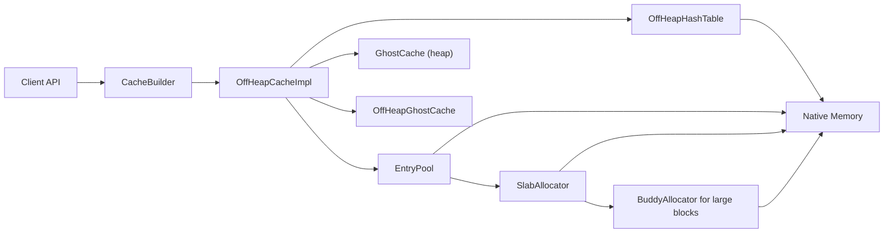

# RMCache

[](https://github.com/codeabbot/rmcache/actions/workflows/ci.yml)
[](LICENSE)

High-Performance, Billion-Scale Off-Heap Cache for Java 25+ (LTS)

RMCache is a specialized caching library designed for ultra-low latency and massive scalability. By leveraging the Java Foreign Function & Memory (FFM) API, it stores data off-heap and avoids GC pauses even when managing very large data sets.

> **Requires JDK 25 or later** (LTS release). The FFM API is stable and fully supported from JDK 25. Run with `--enable-native-access=ALL-UNNAMED`.

---

## Key Features

- Zero-heap data path: keys, values, and index structures live off-heap.
- Java 25+ (LTS) FFM API: no Unsafe dependency.
- 64-bit slot packing: one 64-bit read for hash + slot.
- Key-match fast path + fingerprint check to reduce unnecessary comparisons.
- Zero-copy reads and large-value streaming support.
- GhostCache L1: HEAP, OFF_HEAP, DISABLED, or AUTO selection.
- Memory estimator and index memory budgeting for predictable capacity planning.
- Background eviction to keep hot path latency low.

---

## Architecture



---

## Performance Benchmarks

Benchmarks run on macOS / JDK 25.0.2 (OpenJDK), 4 threads, 2 warmup + 3 measurement iterations.

### Latency (ns/op) - FairComparisonScaleBenchmark - Lower is Better

| Operation | Scale | RMCache | RMCache + GhostCache | ChronicleMap | MapDB | EhCache |
| :--- | :--- | :--- | :--- | :--- | :--- | :--- |
| **GET** | 10,000 | **110 ns** | 143 ns | 257 ns | 1,255 ns | 1,908 ns |
| **GET** | 100,000 | **363 ns** | 382 ns | 336 ns | 1,660 ns | 2,163 ns |
| **GET** | 1,000,000 | 543 ns | **524 ns** | 489 ns | 1,958 ns | 2,365 ns |
| **PUT** | 10,000 | **151 ns** | 122 ns | 556 ns | 3,068 ns | 3,331 ns |
| **PUT** | 100,000 | 357 ns | **297 ns** | 688 ns | 8,831 ns | 2,829 ns |
| **PUT** | 1,000,000 | 486 ns | **479 ns** | 751 ns | 4,809 ns | 2,909 ns |

**Key Observations** (Mar 2026):
- RMCache GET leads at 10K (**2.3× faster** than ChronicleMap, **17× faster** than EhCache).
- RMCache PUT is **3-5× faster** than ChronicleMap across all scales.
- Ghost cache PUT wins at 100K–1M: 297–479 ns vs 357–486 ns for plain RMCache.
- MapDB and EhCache are **5–17× slower** for GET, **6–20× slower** for PUT.

Run yourself: `./gradlew jmh -Pjmh.includes="FairComparisonScaleBenchmark"`

---

## Optimizations for 1B Scale

RMCache includes 9 optimizations designed to minimize memory overhead, reduce hot-path latency, and improve concurrency at billion-entry scale.

| Category | Optimization | Impact |
| :--- | :--- | :--- |
| **Memory** | Compact Entry Header (24B → 20B) | –4 GB @ 1B entries |
| **Memory** | Compact LRU Metadata (9B → 8B) | –1 GB @ 1B entries |
| **Memory** | Capped FrequencySketch Table (16M max) | –7.9 GB @ 1B entries |
| **Latency** | Vectorized Key Comparison (8B/compare) | 20-40% faster GET |
| **Latency** | O(1) Size Class Lookup | Faster allocation |
| **Latency** | Packed AllocationHandle (zero object GC) | No GC on hot path |
| **Concurrency** | Striped LRU Lock (up to 64 shards) | N× less lock contention |
| **Concurrency** | Larger Async Access Buffers (4096) | Better eviction accuracy |
| **GC** | Off-Heap Buddy Allocator | Eliminated heap data structures |

Projected memory at 1B entries: **~326 GB** (down from ~339 GB baseline).

---

## Memory Estimator

RMCache exposes a memory estimator to size off-heap allocations accurately.

**Entry size formula** (approx):

```
EntrySize = HEADER(20) + 4 + pad(keyLen) + 4 + valueLen
```

**Index size formula** (approx):

```
IndexBytes = HashTable(8 * slots) + Offsets(8 * slots) + FreeList(4 * slots)
```

**Total bytes** (approx):

```
Total = DataBytes + IndexBytes + AllocatorOverhead(~10% default)
```

### Example

```java
MemoryEstimator.MemoryEstimate estimate = new CacheBuilder<String, byte[]>()
        .maxEntries(1_000_000)
        .averageKeySize(16)
        .averageValueSize(256)
        .estimateMemory();

System.out.println("Total bytes: " + estimate.totalBytes());
System.out.println("Bytes/entry: " + estimate.bytesPerEntry());
```

---

## Usage

### Dependency

Requires **Java 25+** (LTS) with `--enable-native-access=ALL-UNNAMED`.

```gradle
dependencies {
    implementation 'com.codeabbot:rmcache:1.0.0'
}
```

### Basic Example

```java
import com.codeabbot.rmcache.CacheBuilder;
import com.codeabbot.rmcache.GhostCacheMode;
import com.codeabbot.rmcache.OffHeapCache;
import com.codeabbot.rmcache.Units;

try (OffHeapCache<String, byte[]> cache = new CacheBuilder<String, byte[]>()
        .maxEntries(1_000_000)
        .averageKeySize(16)
        .averageValueSize(256)
        .offHeapMemory(Units.gigabytes(4))
        .ghostCacheMode(GhostCacheMode.AUTO)
        .build()) {

    cache.put("user:123", new byte[256]);
    byte[] value = cache.get("user:123");
}
```

### Zero-Heap Profile

```java
try (OffHeapCache<String, byte[]> cache = new CacheBuilder<String, byte[]>()
        .zeroHeapProfile() // off-heap ghost cache + background eviction
        .ghostCacheMode(GhostCacheMode.AUTO)
        .maxEntries(5_000_000)
        .offHeapMemory(Units.gigabytes(16))
        .build()) {

    // zero-heap hot-path
}
```

---

## Serializer Helper

For custom value types, use `SerializerHelper` to build a `SegmentValueSerializer` without boilerplate.

```java
SegmentValueSerializer<MyType> serializer = SerializerHelper.segment(
        MyType::estimatedSize,
        (value, segment, offset, maxLen) -> value.writeTo(segment, offset, maxLen),
        (bytes, off, len) -> MyType.from(bytes, off, len));

try (OffHeapCache<String, MyType> cache = new CacheBuilder<String, MyType>()
        .valueSerializer(serializer)
        .build()) {
    cache.put("k", new MyType());
}
```

---

## Configuration

| Parameter | Default | Description |
| :--- | :--- | :--- |
| `maxEntries` | 1,000,000 | Target entry count (capacity planning). |
| `averageKeySize` | 32 | Used for memory estimation. |
| `averageValueSize` | 256 | Used for memory estimation. |
| `offHeapMemory` | auto | Total off-heap pool size. |
| `hashTableStripes` | auto | Stripe count (power of 2). Auto: 256 (\u003c100k), 1024 (100k-1M), 4096 (1M-10M), 16384 (10M+). |
| `entryPoolPartitions` | auto | Entry pool partitions (power of 2). |
| `hashTableLoadFactor` | 0.60 | Lower = faster probes, higher = lower index memory. |
| `hashTableInitialCapacity` | auto | Per-stripe hash table capacity. |
| `indexMemoryBudgetBytes` | unset | Budget index memory and auto-adjust load factor. |
| `indexMemoryBudgetPercent` | unset | Budget index memory as % of off-heap pool. |
| `ghostCacheMode` | AUTO | AUTO, HEAP, OFF_HEAP, DISABLED. |
| `ghostCacheSize` | auto | L1 cache capacity. |
| `stringKeyEncoding` | UTF8 | UTF8 or LATIN1 (faster for ASCII). |
| `backgroundEviction` | true | Enable background eviction. |
| `backgroundEvictionInterval` | 10ms | Eviction poll interval. |
| `evictionMemoryWatermarks` | 0.95 / 0.90 | High/low thresholds. |
| `prefetch` | false | Hash-table prefetching. |
| `slabSize` | 64KB | Slab allocator chunk size. |

---

## Index Memory Budgeting

If you want predictable index memory usage, you can set a budget and let the builder derive the hash table size and load factor.

```java
new CacheBuilder<String, byte[]>()
    .maxEntries(1_000_000)
    .offHeapMemory(Units.gigabytes(8))
    .indexMemoryBudgetPercent(0.15) // 15% of off-heap pool
    .build();
```

---

## Memory Scalability

Use the built-in suite to measure actual off-heap usage at different scales:

```
./gradlew runMemoryScalability
```

This prints 10k/100k/1M measurements and a 1B extrapolation. Results depend on key/value sizes.

Latest run (macOS, Java 25, 16B keys / 256B values, 4GB off-heap):

| Scale | Heap (MB) | Off-Heap (MB) | Bytes/Entry |
| :--- | :--- | :--- | :--- |
| 10k | 1.50 | 4.88 | 669.8 |
| 100k | 0.85 | 48.83 | 520.9 |
| 1M | 1.28 | 488.28 | 513.3 |

1B extrapolation: **~326 GB off-heap**, **< 50 MB heap**.

---

## Large Values

Large values (4KB, 8KB, 128KB, 512KB and above) are supported. Values larger than slab size are served by the buddy allocator. For large values, always prefer a `SegmentValueSerializer` to avoid heap buffers.

---

## Notes on Load Factor

Lower load factor:
- Fewer probes
- Lower tail latency
- Higher index memory usage

Higher load factor:
- Lower index memory usage
- Longer probes and higher latency at scale

---

## Documentation

| Document | Description |
| :--- | :--- |
| [Getting Started](docs/getting-started.md) | Quick start, common patterns, sizing |
| [Eviction Policies](docs/eviction-policies.md) | LRU, TTL, composite, filters, listeners |
| [Custom Serialization](docs/custom-serialization.md) | Custom types, segment serializer, framework adapters |
| [Zero-Copy Access](docs/zero-copy-access.md) | `getZeroCopy`/`getView` safety and usage |
| [Heap Profile](docs/heap-profile.md) | Heap breakdown and zero-heap configurations |
| [Architecture](ARCHITECTURE.md) | Internals: memory layout, concurrency model, data structures |
| [Architecture Deep Dive](ARCHITECTURE-DEEP-DIVE.md) | Full builder reference, troubleshooting |
| [Security Policy](SECURITY.md) | Vulnerability reporting |

---

## Contributing

See [CONTRIBUTING.md](CONTRIBUTING.md) for guidelines. All hot-path changes require JMH benchmarks before and after — zero regressions policy.

## License

[Apache License 2.0](LICENSE)
