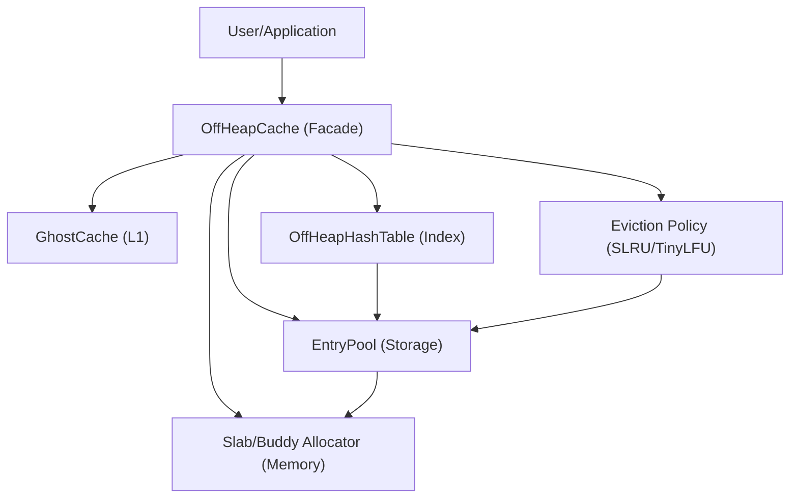

# RMCache Architecture & Technical Design

RMCache is a high-performance, off-heap Java cache designed for extreme scale (up to 1 Billion entries) with ultra-low latency. It leverages the Java 25 Foreign Function & Memory (FFM) API to manage memory outside the Java heap, avoiding GC overhead while maintaining high throughput.

---

## 🏗 High-Level Architecture

RMCache is composed of several specialized layers that work in harmony to provide high concurrency and memory efficiency.



---

## 🧠 Memory Management

### 1. Native Memory Layer (`NativeMemory`)
Uses the FFM API (`MemorySegment`, `Arena`) to interact directly with raw hardware memory. This provides significantly better performance than `ByteBuffer` or `Unsafe` by offering type-safe, unaligned, and vectorized memory access.

### 2. Hybrid Allocator (`SlabAllocator` & `BuddyAllocator`)
- **Slab Allocator**: Optimizes for common entry sizes by pre-allocating large chunks called "slabs" and dividing them into fixed-size blocks. This ensures O(1) allocation/free time and zero fragmentation for standard cache entries.
- **Buddy Allocator**: Handles large or variable-sized allocations (usually > 64KB) by recursively splitting memory blocks into halves (buddies).
- **Packed Handles**: Allocation metadata (offset, capacity, size class) is bit-packed into a single `long` to avoid Java object allocation on the hot path.

---

## 🔍 Indexing & Storage

### 1. Off-Heap Hash Table (`OffHeapHashTable`)
- **Robin Hood Hashing**: Reduces "long tail" probe lengths by shifting entries based on their distance from their ideal bucket.
- **StampedLock Concurrency**: Uses optimistic read stamps to allow concurrent reads without locking. Only writes (inserts/deletes) acquire a write lock.
- **Striped Table**: The table is divided into multiple independent shards (shards) to minimize lock contention under high write load.
- **Packed Slots**: Each 8-byte slot in the table packs both the 32-bit key hash and the 32-bit slot ID.

### 2. Entry Pool (`EntryPool`)
Manages the actual data entries stored off-heap.
- **Entry Layout**: A compact 20-byte header tracks hash, expiration, slot ID, and size class.
- **Packed Offsets (O8)**: To eliminate native memory reads during lookup, the size class is packed into the upper bits of the 64-bit offset table.
- **Vectorized Key Comparison**: Uses 64-bit (long-word) reads to compare keys 8 bytes at a time, significantly faster than byte-by-byte comparison.

---

## ⚡ Performance Optimizations

| ID | Optimization | Description |
| :--- | :--- | :--- |
| **O1** | Ghost Cache Flags | Pre-computes boolean flags for L1 cache presence to skip null checks in the hot path. |
| **O2** | Lock-Free Updates | Allows in-place value updates without locking if the new value fits in the existing memory block. |
| **O5** | Serializer Caching | Avoids repeated `instanceof` checks by caching specific serializer types (Segment vs Stream). |
| **O8** | Packed Offsets | Stores the size class within the 64-bit address entry to save native memory reads. |
| **L1** | Ghost Cache | A small, fast L1 cache (Heap or Off-Heap) that stores hot key mappings to bypass full hash table probes. |

---

## ♻️ Eviction & Maintenance

### W-TinyLFU Strategy
RMCache implements a W-TinyLFU eviction policy, which combines the frequency-based benefits of TinyLFU with the recency-based benefits of LRU.

1. **Window Segment**: Admits all new entries initially (best for bursty workloads).
2. **Probation Segment**: Entries that leave the window enter probation. They are candidates for eviction.
3. **Protected Segment**: Frequent entries are promoted here and are resistant to eviction.
4. **Frequency Sketch**: An off-heap count-min sketch tracks the access frequency of millions of keys using only a few MBs of memory.

### Background Maintenance
A dedicated background thread (`rmcache-maintenance`) periodically drains cleanup queues and handles deferred memory freeing, keeping the hot path "pure" and predictable.

---

## 🚀 Usage Guide

### Simple Initialization
```java
OffHeapCache<String, byte[]> cache = new CacheBuilder<String, byte[]>()
    .maxEntries(1_000_000)
    .offHeapMemory(Units.gigabytes(2))
    .build();
```

### Advanced Optimization
```java
OffHeapCache<String, UserProfile> cache = new CacheBuilder<String, UserProfile>()
    .maxEntries(10_000_000)
    .zeroHeapProfile()         // Off-heap L1 cache + background tasks
    .stringKeyEncoding(StringEncoding.LATIN1) // Fast-path for ASCII strings
    .valueSerializer(new MyFastSerializer())
    .build();
```

### Zero-Copy Access
For maximum performance, access raw memory segments directly to avoid copying data to the Java heap.
```java
cache.getZeroCopy("key", segment -> {
    // Process data directly in native memory
    return processedResult;
});
```
